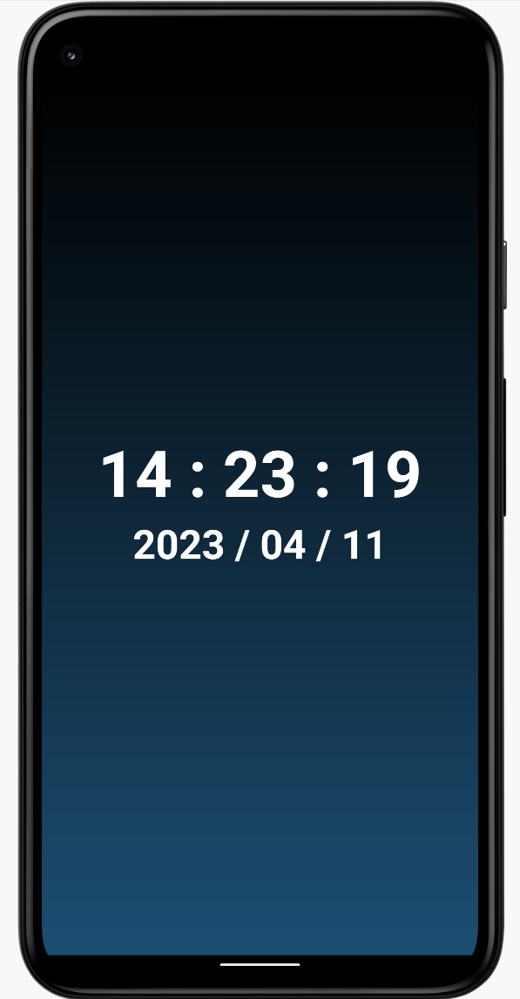

# Android Develop

**北京邮电大学计算机学院 2023年春 移动互联网技术与应用 作业汇总**

### 小作业1: 时钟页面
详见 `/Clock` 文件夹  

### 小作业2：音乐播放器
详见 `/MusicPlayer` 文件夹  

实现功能:  
1. 可视化进度条
2. 可视化播放时间及歌曲长度
3. 可拖动/可点击进度条
4. 播放结束自动触发“停止”  

### 期末作业：自由选题
详见 `/Final` 文件夹  

**ScAnimal - 野生动物识别系统**  
1. 期末作业要求参阅 `/Final/project.docx`
2. 期末作业汇报参阅 `/Final/report.pdf`
3. 主要基于 `Kotlin` 构建
4. 接入Baidu野生动物识别API进行云端识别

